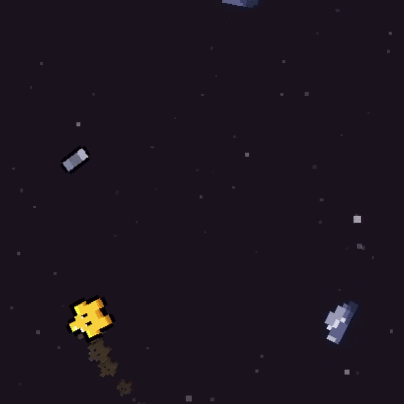

# Starr Journey
A casual web game about Starr dodging obstacles, built with KAPLAY.

## How to Play
1. Drag your mouse or swipe your thumb to control Starr ⭐️
2. Dodge obstacles, collect coins, and try to go as far as you can 🚀
3. That's it!

(Note that Coins doesn't have any usage yet, will add soon)

## Try It Now
Simply click [this link](https://starrjourney.pages.dev) and enjoy! 😀

## How It Works
I built this with KAPLAY, a JavaScript library for making web games.
- First, load all the sprites, animations, and sound effects that I need via `loadSprite()`
- Then, use `add()` and `sprite("starr")` to add Starr (the player) to the scene, and use `lerp(starr.pos.x, toWorld(mousePos()).x, 0.1)` to make Starr follow the player's mouse. The third parameter `0.1` is the delay, which is where the difficulty comes from >:)
- Finally, add the event listener `starr.onCollide("rock", (rock) => {})`, which will run things in the code block `{}` once (such as `explosion.play("explode")`) when Starr collides with a rock.

## Credits & Attribution
- Most VFX and SFX: From various sources like game assets on [itch.io](https://itch.io/game-assets), all licensed under [CC0 1.0 Universal](https://creativecommons.org/publicdomain/zero/1.0/deed.en)
- Background Music: **Pixel Peeker Polka - slower**, **Pixelland**, and **Reformat** by Kevin MacLeod (incompetech.com). Licensed under [Creative Commons: By Attribution 4.0 License](http://creativecommons.org/licenses/by/4.0/)
- Thank you ❤️
